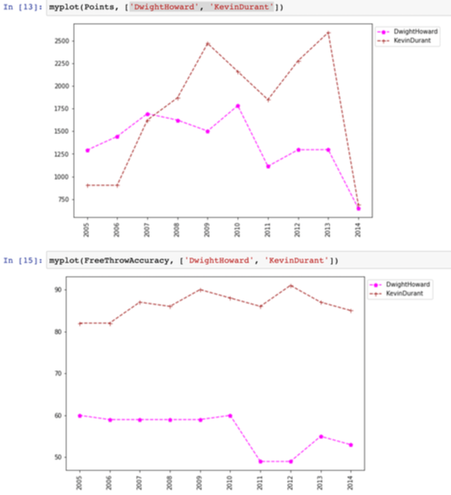
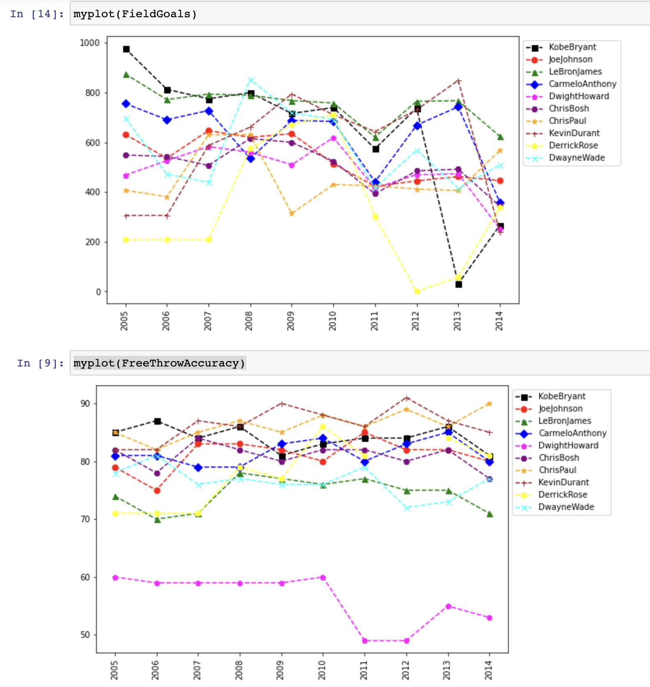
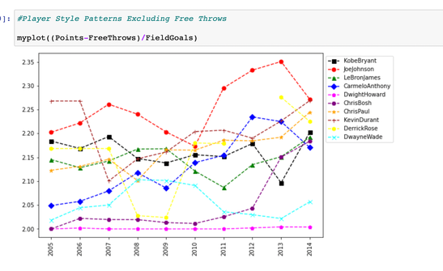

# [Project 1: NBA Players' Performance Analysis](https://github.com/beneyup/Python-Portfolio-Projects/tree/master-branch)

In this project, we're going to analyze how NBA players performed over years
by using; NumPy(arrays and matrixes), dictionaries, functions and matplotlib.

